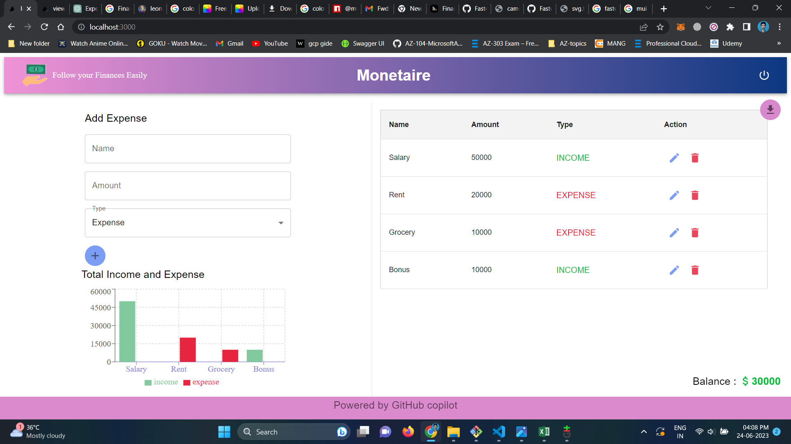
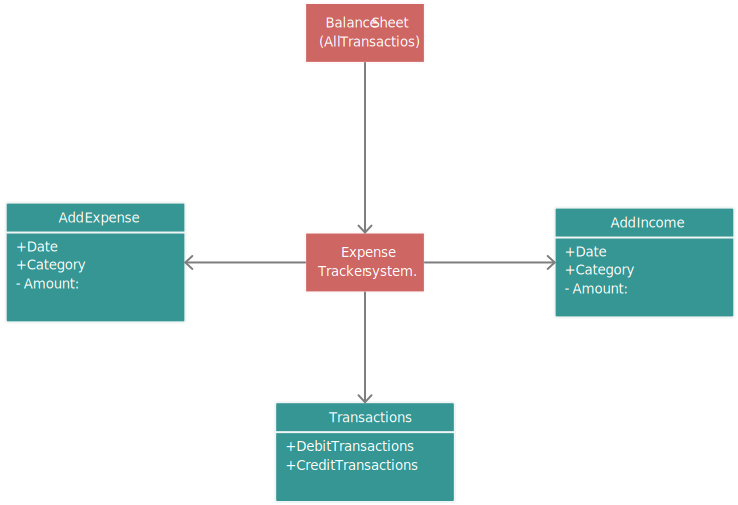

# MONETAIRE - Follow your Finances Easily

Monetaire is a web-based personal finance tracker application built with Next.js. It allows users to track their income and expense transactions, edit existing transactions, and view the current balance.

## Features

- Add income and expense transactions
- Edit existing transactions
- Delete transactions
- Display current balance
- Download all transaction details as JSON file
- Visually display

## Technologies Used

- Next.js: A React framework for building server-side rendered and statically generated applications.
- Material-UI: A popular React UI framework for building stylish and responsive user interfaces.

## Getting Started

1. Clone the repository:

## Usage

1. On the homepage, you will see a form to add a new transaction. Select the transaction type (income or expense), enter a description, and the transaction amount. Click "Add Transaction" to add it to the list.

2. The transactions will be displayed in a list format, showing the description and amount. You can edit a transaction by clicking the "Edit" button, make the necessary changes, and save it.

3. To delete a transaction, click the "Delete" button next to the transaction.

4. The current balance will be automatically calculated based on the income and expense transactions.

## Contributing

Contributions are welcome! If you find any issues or have suggestions for improvements, feel free to open an issue or submit a pull request.

<b>1.Screenshot of Work Product</b>

<b>2.Architecture Diagram</b>

<b>3.Description</b>
    Monetaire, otherwise known as expense tracking, is the process of keeping tabs on your income and spending, ideally on a daily basis. It’s achieved by recording receipts, invoices, and business expenses into some form of the accounting ledger. It goes hand in hand with budgeting and is a valuable way to keep tabs on your business finances.

<b>Review</b>

The code suggestions provided by Copilot are often accurate and helpful, allowing me to write code more efficiently. It can generate code for various programming languages and frameworks, which is convenient when working on different projects with diverse tech stacks.

One of the notable features of Copilot is its ability to understand the intent of my code and generate contextually relevant suggestions. It adapts to my coding style and learns from my codebase, which improves the accuracy of its suggestions over time.

However, being a new user, there are instances where Copilot's suggestions may not be precisely what I intended or may not align with the coding standards of the project. In such cases, I need to review and modify the generated code accordingly.